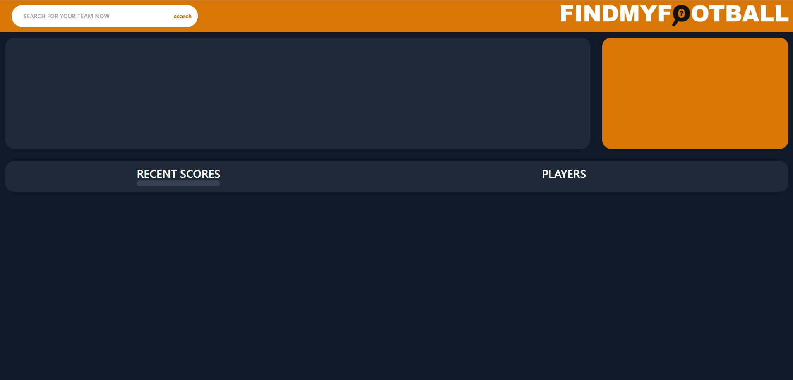
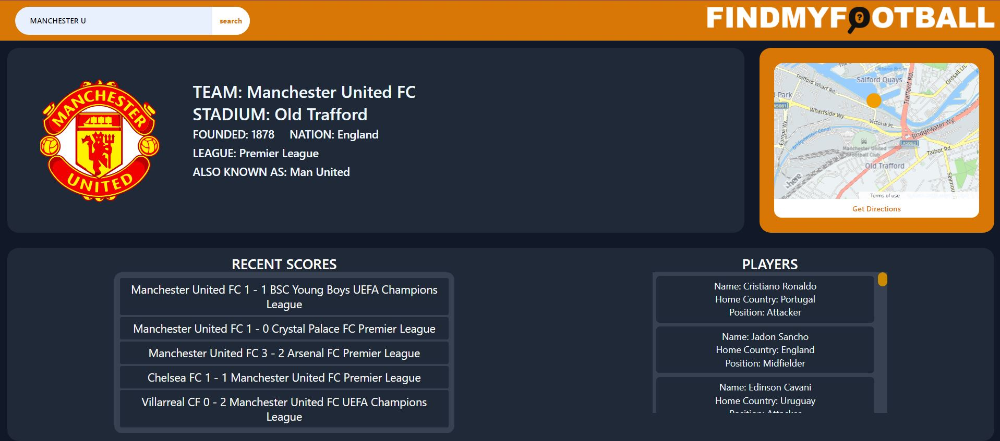

## FIND MY FOOTBALL

## https://github.com/HarkyDev/FindMyFootballApp

 

## LANGUAGES
JavaScript - CSS - HTML

## TOOLS
Football Data API - HERE Maps API - Google Maps

## ABOUT THIS PROJECT
The idea of this project was a fairly simple one from a users point of view. The concept was to have a user be able to see their football(soccer) team of choice from the top competitive leagues in the world, and see some relative information about their team. But most importantly, as the name suggests, a user can find the geographical physical location of where the teams stadium is located. As we all know, its no good knowing you're going to go see a team on bright Saturday morning just to not know where the stadium is. After making their choice of team, the user should be presented with said information and a map that shows a marker of where the stadium could be found on a map that is rendered on the page as well. A directions button below takes the user to the Google routeplanner.  

## THINGS TO IMPROVE ON 
- Zoom in and out buttons on map
- Better API to avoid CORS errors
- Better utilise local storage
- Would have added more leagues if the api could handle it without erroring on our free plan
- Possibly add more information about team on the bottom section
- Develop the UI more - less dead space, more engaging

## EXPECTED EXPERIENCE
A user is presented with the logo, no preloaded data, and a search bar

 

When an acceptable search is entered, team information, crest and stadium location map are displayed. 

 

## LINKS
- REPO https://github.com/HarkyDev/FindMyFootballApp
- DEPLOYED SITE https://harkydev.github.io/FindMyFootballApp/

